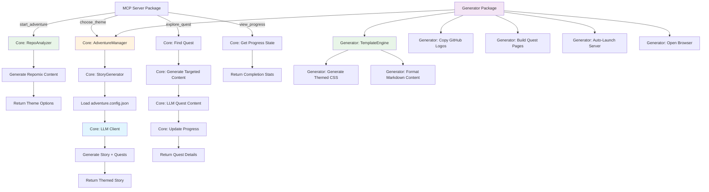
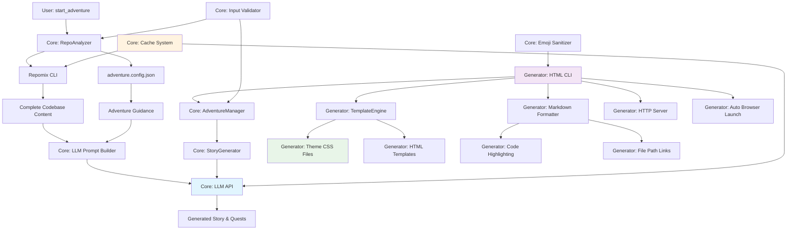

# AI Repo Adventures


A fun, Model Context Protocol (MCP) server and/or HTML generator that transforms code repositories into interactive adventures! Explore codebases through engaging stories with themes and characters that represent different technologies and architectural components.

## Features

🎮 **Story-based Code Exploration** - Turn learning about codebases into a "choose your own adventure" story
📚 **Educational Analogies** - Complex technical concepts explained through relatable story elements  
🌟 **Multiple Themes** - Choose from Space, Medieval, or Ancient Civilization themes
🤖 **Character-Based Learning** - Meet characters that represent different technologies (Database Dragons, API Messengers, etc.)
🔍 **Choose Your Own Adventure** - Interactive exploration paths through the codebase
🌐 **HTML Adventure Generation** - Export your adventures as beautiful, standalone HTML websites
🚀 **Auto-Launch Web Server** - Automatically starts a local server and opens your adventure in the browser
🎨 **Themed Styling** - Rich CSS themes with gradient titles, code highlighting, and responsive design

## How It Works

1. **Start Adventure** - The server analyzes your project using repomix and presents theme options
2. **Choose Theme** - Select from Space Exploration, Mythical Kingdom, or Ancient Civilization
3. **Explore Quests** - Follow dynamically generated quest paths through your codebase
4. **View Progress** - Track your exploration progress and see completed areas
5. **Learn Through Story** - Understand complex systems through engaging LLM-generated narratives
6. **Export to HTML** - Generate beautiful web adventures for sharing or offline exploration

## Architecture Flow



## 🔍 Project Context Gathering & LLM Integration

### Data Flow Architecture



### Phase 1: Project Analysis & Context Gathering

#### Step 1: Initial Project Scan
**Location:** `packages/core/src/analyzer/repo-analyzer.ts`

When `start_adventure` is called, the system:
1. **Executes Repomix CLI** as a subprocess (`npx repomix`)
2. **Captures stdout** containing the entire codebase structure and content
3. **Caches result** with SHA256 hash for 5-minute reuse

**Repomix Output Structure:**
```markdown
# Project Summary
- Files: 50
- Languages: TypeScript (85%), JavaScript (15%)

## File: src/server.ts
```typescript
class RepoAdventureServer {
  constructor() { ... }
  setupHandlers() { ... }
}
```
// ... continues for ALL files in the project
```

#### Step 2: Quest Config Loading
**Location:** `packages/core/src/shared/adventure-config.ts`

Optionally loads `adventure.config.json` from the project root, which provides:
- Predefined quest titles and descriptions
- Important files and functions to highlight
- Workshop-style exploration guidance

### Phase 2: LLM Prompt Construction

#### What Gets Sent to LLM for Initial Story Generation

The system sends a comprehensive prompt containing:

1. **Complete Repomix Output** - Every file in the project with full content
2. **Quest Config Guidance** (if available) - Predefined quests with highlighted functions
3. **Theme Guidelines** - Vocabulary, metaphors, and style rules for the selected theme
4. **Critical Instructions** - Rules for code authenticity and story structure

**Example prompt structure:**
```markdown
You are a technical education specialist creating story-based workshops...

## Complete Codebase
[Full repomix output with all files]

## Quest Guidance
Quest: "Core MCP Server"
Files:
    File: src/server.ts
    Key Functions:
      - RepoAdventureServer.setupHandlers: Registers handlers
      [... more highlights]

## Theme Guidelines
[Space/Mythical/Ancient vocabulary and mappings]

## Response Format
Return JSON with story and adventures array
```

#### LLM Response
The LLM generates:
- A 2-3 paragraph themed story introducing the codebase
- 2-6 dynamic quests based on project complexity
- Each quest includes specific files to explore

### Phase 3: Individual Quest Content Generation

#### What Gets Sent for Each Quest

When exploring a specific quest:

1. **Targeted File Content** - Only files relevant to that quest
2. **Workshop Highlights** - Specific functions to explore step-by-step
3. **Theme Continuity** - Same vocabulary for consistent narrative
4. **Code Authenticity Rules** - Must use actual code from files

**Example quest prompt:**
```markdown
Continue the space-themed exploration for: "Command Protocols"

## Complete Codebase
[Only relevant files for this quest]

## Workshop Highlights (Focus Areas)
Create a step-by-step workshop for:
- RepoAdventureServer.constructor: Creates MCP server
- RepoAdventureServer.setupHandlers: Registers handlers
[... more function highlights]

## Response Format
Return JSON with quest narrative, code snippets, and hints
```

### Quest Configuration System

#### adventure.config.json Structure

Projects can include an `adventure.config.json` file to guide story and quest generation:

```json
{
  "quests": [
    {
      "title": "Core MCP Server",
      "description": "Explore the MCP protocol implementation",
      "files": [
        {
          "path": "src/server.ts",
          "description": "Main MCP server",
          "highlights": [
            {
              "name": "RepoAdventureServer.setupHandlers",
              "description": "Registers ListTools and CallTool handlers"
            }
          ]
        }
      ]
    }
  ]
}
```

This configuration:
- **Guides quest titles** toward important code areas
- **Highlights key functions and members** for workshop-style exploration
- **Provides context** for more accurate story generation

### Context Flow Summary

| Component | Purpose | What It Adds to LLM Context |
|-----------|---------|----------------------------|
| **Repomix** | Full codebase analysis | Actual code, file structure, all content |
| **Quest Config** | Guidance structure | Important functions to highlight, suggested titles |
| **Theme System** | Narrative consistency | Vocabulary, metaphors, character types |
| **Workshop Highlights** | Educational focus | Step-by-step exploration of key functions |

### Optimization Features

- **Targeted Content**: Quests only receive relevant file content
- **Smart Caching**: Repomix output cached for 5 minutes, LLM responses cached
- **Config Loading**: Loaded once per session if available
- **Fallback System**: Works without LLM using template-based stories

## Installation

```bash
npm install
npm run build
```

## 🚀 Automated Releases

This project uses **Lerna** with **conventional commits** for automated versioning and publishing to npm.

### **📦 Available Packages**

- **`@codewithdan/ai-repo-adventure-generator`** - CLI tool for generating HTML adventure websites
- **`@codewithdan/ai-repo-adventure-mcp`** - Model Context Protocol server for interactive code exploration

### **🔄 Release Process**

Releases are automatically triggered when you push to `main` with conventional commit messages:

```bash
# Examples of commits that trigger releases:
git commit -m "feat(generator): add new theme support"     # Minor version bump
git commit -m "fix(mcp): resolve connection issue"         # Patch version bump  
git commit -m "feat(core)!: breaking API change"          # Major version bump

# Non-releasing commits:
git commit -m "docs: update README"                        # No version bump
git commit -m "test: add unit tests"                       # No version bump
```

### **🏷️ Manual Release Commands**

```bash
npm run release:check        # See what packages have changed
npm run version:patch        # Manual patch version bump
npm run version:minor        # Manual minor version bump  
npm run version:major        # Manual major version bump
```

See [CONTRIBUTING.md](.github/CONTRIBUTING.md) for complete conventional commit guidelines.

## Quick HTML Adventure Test

Generate a beautiful HTML adventure website with just one command:

```bash
npm run test:html                     # Default: mythical theme
npm run test:html -- --theme=space    # Specify theme (space, mythical, ancient, developer)
```

This will:
- 🧪 Run a minimal test using only 2 LLM calls (1 story + 1 quest)
- 🌐 Generate a complete HTML adventure website in `tests/public/`
- 🚀 Automatically start a local HTTP server on port 8080
- 🎯 Open your browser to view the adventure immediately
- 🎨 Include full themed CSS styling and responsive design

**Perfect for:** Testing the system, sharing adventures, or creating standalone exploration websites.

## Configuration

### LLM Setup (Optional - Enables Dynamic Story Generation)

The server supports multiple LLM providers through a generic OpenAI-compatible client:

1. **Choose Your Provider** and copy the configuration:
   ```bash
   cp .env.example .env
   ```

2. **Configure Your Preferred Provider**:

   **🆓 GitHub Models (Free tier available - but limited)**:
   ```bash
   GITHUB_TOKEN=your_github_token_here
   LLM_BASE_URL=https://models.inference.ai.azure.com
   LLM_MODEL=gpt-4o-mini
   ```

   **🔥 OpenAI (Direct)**:
   ```bash
   LLM_API_KEY=your_openai_key_here
   LLM_BASE_URL=https://api.openai.com/v1
   LLM_MODEL=gpt-4o-mini
   ```

   **🏢 Azure OpenAI**:
   ```bash
   LLM_API_KEY=your_azure_key_here
   LLM_BASE_URL=https://your-resource.openai.azure.com/openai/deployments/your-deployment
   LLM_MODEL=gpt-4o
   LLM_API_VERSION=2025-01-01-preview
   ```

   **🏠 Local Ollama**:
   ```bash
   LLM_BASE_URL=http://localhost:11434/v1
   LLM_API_KEY=ollama
   LLM_MODEL=llama3.2
   ```

3. **Fine-tune Settings** (Optional):
   ```bash
   LLM_TEMPERATURE=1.0      # Creativity (0.0-2.0)
   LLM_MAX_TOKENS=1000      # Response length
   ```

**📝 Model Recommendations**:
- **Best Creative Writing**: `gpt-4o`
- **Most Cost-Effective**: `gpt-4o-mini`  
- **Local/Private**: `llama3.2` (via Ollama)

## Testing

```bash
# Core MCP functionality tests
npm test                 # Run comprehensive test suite
npm run test:unit        # Core algorithm and component tests
npm run test:integration # LLM integration tests
npm run test:simple      # Basic MCP workflow test
npm run test:real-world  # Full MCP integration test

# HTML generation tests
npm run test:html        # Generate HTML adventure with auto-launch

# Interactive testing
npm run chat             # Interactive terminal test MCP client
```

## Available Tools

### `start_adventure`
Analyzes your code repository using repomix and begins an interactive, gamified exploration experience. Presents theme options for your adventure.

**Parameters:**
- `projectPath` (optional): Path to project directory (defaults to current directory)

### `choose_theme`
Generates a personalized, LLM-powered narrative adventure based on your selected theme. Creates dynamic adventures based on your actual project structure.

**Parameters:**
- `theme`: "space", "mythical", "ancient", "developer" (also accepts numbers: 1, 2, 3, 4)

### `explore_quest`
Executes a chosen quest to explore specific parts of your codebase through LLM-generated narrative content. Reveals code insights wrapped in themed storytelling.

**Parameters:**
- `choice`: Quest number (1, 2, 3) or quest title/partial title

### `view_progress`
Displays comprehensive progress tracking for your code exploration adventure. Shows completion percentage, completed adventures, and remaining areas to explore.

**Parameters:**
- None required - automatically tracks state from previous tool calls

## HTML Adventure Generator

Create beautiful, standalone HTML adventure websites from your code exploration:

### Interactive CLI Generator
```bash
npm run generate-html
```

**Features:**
- 🎨 Choose from Space, Mythical, Ancient, Developer, or Custom themes
- 📁 Choose the output directory
- 🌐 Complete HTML website with CSS and assets
- 🚀 Auto-launch local server and browser
- 📱 Responsive design for all devices
- 🎯 GitHub integration with automatic file linking

### Command-Line Options
```bash
npm run generate-html [options]

Options:
  --theme              Theme: space, mythical, ancient, developer, or custom
  --output             Output directory (default: ./public)
  --overwrite          Overwrite existing files without prompting
  --help, -h           Show help message

Examples:
  npm run generate-html  # Interactive mode
  npm run generate-html --theme space --output ./public --overwrite
  npm run generate-html --theme mythical --output ./adventure-site
```

### Quick Test Generator
```bash
npm run test:html
```

**Perfect for:**
- 🧪 Testing HTML generation (only 2 LLM calls)
- 🎯 Quick development iteration
- 📋 Creating demo adventures
- 🚀 Sharing adventures with others

### HTML Generator Features

The HTML generator (`packages/generator/src/cli/html-generator.ts`) creates fully-featured adventure websites:

**Core Capabilities:**
- **Theme System**: 5 built-in themes with custom theme support
- **Template Engine**: Dynamic HTML generation with variable substitution
- **Markdown Processing**: Full markdown to HTML conversion with code highlighting using Prism.js
- **File Path Linking**: Automatic GitHub URL generation for code files
- **Responsive Design**: Mobile-first CSS with gradient styling
- **Navigation System**: Quest-to-quest navigation with progress tracking

**Generated Structure:**
```
output-directory/
├── index.html              # Main adventure page with story
├── quest-1.html            # Individual quest pages
├── quest-2.html
├── quest-3.html
└── assets/
    ├── theme.css          # Combined theme + base + animations CSS
    └── images/
        ├── github-mark.svg       # Dark GitHub logo for light themes
        └── github-mark-white.svg # White GitHub logo for dark themes
```

## Example Adventure Flow

```
1. start_adventure() 
   → Generates repomix content for your TypeScript/Node.js project
   → "🌟 Welcome to Repo Adventures! You've discovered 45 files of digital wisdom!"
   → "Choose Your Story Theme: 1. 🚀 Space 2. 🏰 Mythical 3. 🏛️ Ancient"

2. choose_theme("space")
   → LLM analyzes your repomix content and generates personalized story
   → "In the cosmic realm of API Service, the advanced Starship 'TypeScript' 
      navigates through 45 star systems..."
   → "Available Quests: 1. 🧭 Navigation Protocols 2. 📡 Communication Hub"

3. explore_quest("1")
   → LLM generates detailed quest content using actual code files
   → "As you enter the Navigation Control Center, you discover the sacred 
      algorithm that guides all requests..."
   → Shows real code snippets with explanations in space theme
   → "Progress: 33% complete (1/3 quests finished)"

4. view_progress()
   → "📊 Quest Progress: 33% complete"
   → "✅ Completed: Navigation Protocols"
   → "🗺️ Remaining: Communication Hub, System Diagnostics"
```
## Monorepo Structure

```
packages/
├── core/                           # @ai-repo-adventures/core (shared business logic)
│   └── src/
│       ├── adventure/              # Adventure generation system
│       │   ├── adventure-manager.ts   # Orchestrates adventure state and user interactions
│       │   └── story-generator.ts     # LLM-powered story and quest generation
│       ├── analyzer/               # Code analysis and repomix integration
│       │   └── repo-analyzer.ts    # Repository analysis and content generation
│       ├── llm/                    # LLM integration
│       │   └── llm-client.ts       # Multi-provider LLM client (OpenAI, Azure, Ollama, etc.)
│       └── shared/                 # Shared utilities and types
│           ├── types.ts            # Core type definitions
│           ├── theme.ts            # Theme system and validation
│           ├── config.ts           # Configuration and environment settings
│           ├── input-validator.ts  # Security and input validation
│           ├── emoji-validator.ts  # Emoji sanitization for HTML output
│           └── adventure-config.ts # Adventure configuration parser
├── generator/                      # @codewithdan/ai-repo-adventure-generator (HTML CLI)
│   └── src/cli/
│       ├── html-generator.ts       # Interactive HTML adventure generator with CLI options
│       ├── template-engine.ts      # HTML template processor with variable substitution
│       ├── assets/                 # Static assets for HTML generation
│       │   └── images/             # GitHub logos and theme images
│       ├── templates/              # HTML templates for generation
│       └── themes/                 # CSS theme files
│           ├── space.css           # Space theme styling
│           ├── mythical.css        # Mythical theme styling
│           ├── ancient.css         # Ancient theme styling
│           ├── developer.css       # Developer theme styling
│           ├── custom.css          # Custom theme base
│           ├── base.css            # Base styling for all themes
│           └── animations.css      # CSS animations and transitions
└── mcp/                           # @codewithdan/ai-repo-adventure-mcp (MCP server)
    └── src/
        ├── server.ts              # Main MCP server entry point
        └── tools/                 # MCP tool definitions
            └── tools.ts           # 4 main tools: start_adventure, choose_theme, explore_quest, view_progress

tests/                             # Shared test suite
├── unit/                          # Unit tests for individual components
└── integration/                   # Integration tests with LLM providers

.github/workflows/                 # Automated release pipeline
└── release.yml                    # Lerna + conventional commits automation
```

## Contributing

Contributions welcome! This project uses **conventional commits** and **automated releases**.

### 🚀 **Getting Started**
```bash
git clone https://github.com/danwahlin/ai-repo-adventures.git
cd ai-repo-adventures
npm install
npm run build
npm run test:unit
```

### 📝 **Commit Message Format**
Use [conventional commits](https://www.conventionalcommits.org/) for automatic versioning:
```bash
feat(generator): add new theme support      # Minor version bump
fix(mcp): resolve connection issue          # Patch version bump  
feat(core)!: breaking API change           # Major version bump
docs: update README                         # No version bump
```

### 🏗️ **Development Workflow**
```bash
# Work on features
npm run build                    # Build all packages
npm run test:unit               # Run unit tests
npm run lint                    # Check code quality

# Test specific components
npm run test:simple             # Test MCP server
npm run test:html               # Test HTML generation
npm run chat                    # Interactive MCP client
```

### 📦 **Package Development**
- **Core Package** (`packages/core/`): Shared business logic and utilities
- **Generator Package** (`packages/generator/`): HTML generation CLI tool  
- **MCP Package** (`packages/mcp/`): Model Context Protocol server

### 🎯 **Areas for Contribution**
- 🎨 New CSS themes and styling (`packages/generator/src/cli/themes/`)
- 🌍 Additional language support in analysis
- 🔧 New quest generation algorithms
- 🧪 Additional test coverage
- 📖 Documentation improvements

See [CONTRIBUTING.md](.github/CONTRIBUTING.md) for detailed contribution guidelines.  

## License

MIT

## Prompt for adventure.config.json Generation

Run this in GitHub Copilot, Claude Code, or your favorite AI editor to generate an initial `adventure.config.json` file. This file is key to helping the LLM understand the project's structure and key components.

---

Analyze the overall project and determine key "adventure quest" paths to help people understand the monorepo structure and main functionality. Your results will go into the root of the project into a file named adventure.config.json. Focus on the packages/ structure and key integration points. Use the updated file paths as shown in the following JSON:

{
    "quests": [
        {
            "title": "MCP Server Interface",
            "description": "Understanding how users interact with the system through the 4 main MCP tools",
            "files": [
                {
                    "path": "packages/mcp/src/tools/tools.ts",
                    "description": "The 4 main MCP tools that provide the user interface to the adventure system",
                    "highlights": [
                        {
                            "name": "start_adventure.handler",
                            "description": "Analyzes repositories and presents theme options to users"
                        },
                        {
                            "name": "choose_theme.handler", 
                            "description": "Generates themed stories and adventures based on user selection"
                        },
                        {
                            "name": "explore_quest.handler",
                            "description": "Executes individual quest exploration with progress tracking"
                        },
                        {
                            "name": "view_progress.handler",
                            "description": "Shows completion stats and remaining quests"
                        }
                    ]
                }
            ]
        },
        {
            "title": "Core Adventure Engine",
            "description": "The heart of the adventure generation system with LLM integration",
            "files": [
                {
                    "path": "packages/core/src/adventure/adventure-manager.ts",
                    "description": "Orchestrates adventure state and manages user interactions",
                    "highlights": [
                        {
                            "name": "AdventureManager.initializeAdventure",
                            "description": "Creates themed stories and quests using LLM"
                        },
                        {
                            "name": "AdventureManager.exploreQuest",
                            "description": "Executes quest exploration with targeted content generation"
                        }
                    ]
                },
                {
                    "path": "packages/core/src/adventure/story-generator.ts",
                    "description": "LLM-powered story and quest content generation",
                    "highlights": [
                        {
                            "name": "StoryGenerator.generateWithLLM",
                            "description": "Generates themed narratives using multiple LLM providers"
                        }
                    ]
                }
            ]
        },
        {
            "title": "HTML Adventure Generation",
            "description": "CLI tool for creating beautiful standalone HTML adventure websites",
            "files": [
                {
                    "path": "packages/generator/src/cli/html-generator.ts",
                    "description": "Interactive HTML adventure generator with theme support and auto-launch",
                    "highlights": [
                        {
                            "name": "HTMLAdventureGenerator.generateAdventure",
                            "description": "Main orchestrator for HTML website generation"
                        },
                        {
                            "name": "HTMLAdventureGenerator.generateThemeCSS",
                            "description": "Creates themed CSS files with responsive design"
                        }
                    ]
                }
            ]
        }
    ]
}

Show me what you plan to use for quests and files members before proceeding and doing any updates adventure.config.json. I'll review and provide feedback.