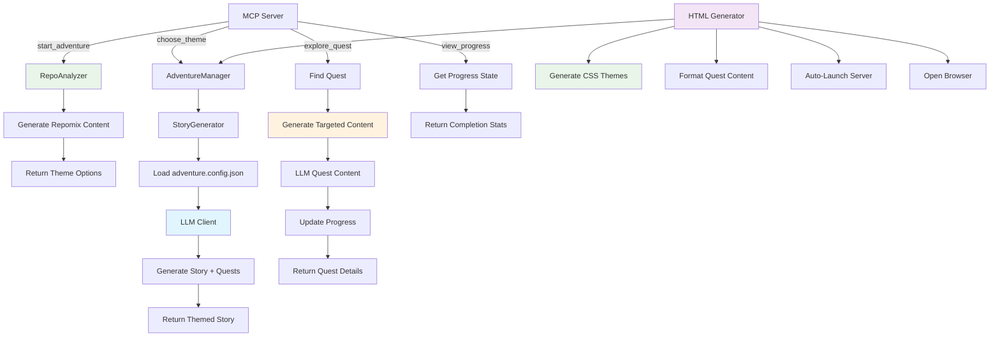
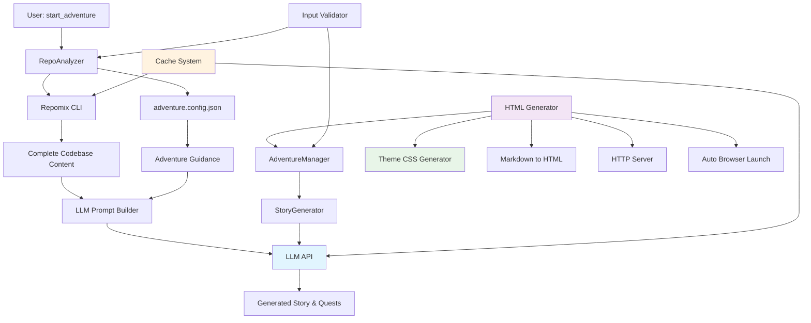

# Repo Adventure MCP Server

A fun, Model Context Protocol (MCP) server that transforms code repositories into interactive adventures! Explore codebases through engaging stories with characters that represent different technologies and architectural components.

## Features

🎮 **Story-based Code Exploration** - Turn learning about codebases into a "choose your own adventure" story
📚 **Educational Analogies** - Complex technical concepts explained through relatable story elements  
🌟 **Multiple Themes** - Choose from Space, Medieval, or Ancient Civilization themes
🤖 **Character-Based Learning** - Meet characters that represent different technologies (Database Dragons, API Messengers, etc.)
🔍 **Choose Your Own Adventure** - Interactive exploration paths through the codebase
🌐 **HTML Adventure Generation** - Export your adventures as beautiful, standalone HTML websites
🚀 **Auto-Launch Web Server** - Automatically starts a local server and opens your adventure in the browser
🎨 **Themed Styling** - Rich CSS themes with gradient titles, code highlighting, and responsive design

## How It Works

1. **Start Adventure** - The server analyzes your project using repomix and presents theme options
2. **Choose Theme** - Select from Space Exploration, Mythical Kingdom, or Ancient Civilization
3. **Explore Quests** - Follow dynamically generated quest paths through your codebase
4. **View Progress** - Track your exploration progress and see completed areas
5. **Learn Through Story** - Understand complex systems through engaging LLM-generated narratives
6. **Export to HTML** - Generate beautiful web adventures for sharing or offline exploration

## Architecture Flow



## 🔍 Project Context Gathering & LLM Integration

### Data Flow Architecture



### Phase 1: Project Analysis & Context Gathering

#### Step 1: Initial Project Scan
**Location:** `src/analyzer/repo-analyzer.ts`

When `start_adventure` is called, the system:
1. **Executes Repomix CLI** as a subprocess (`npx repomix`)
2. **Captures stdout** containing the entire codebase structure and content
3. **Caches result** with SHA256 hash for 5-minute reuse

**Repomix Output Structure:**
```markdown
# Project Summary
- Files: 50
- Languages: TypeScript (85%), JavaScript (15%)

## File: src/server.ts
```typescript
class RepoAdventureServer {
  constructor() { ... }
  setupHandlers() { ... }
}
```
// ... continues for ALL files in the project
```

#### Step 2: Quest Config Loading
**Location:** `src/shared/adventure-config.ts`

Optionally loads `adventure.config.json` from the project root, which provides:
- Predefined quest titles and descriptions
- Important files and functions to highlight
- Workshop-style exploration guidance

### Phase 2: LLM Prompt Construction

#### What Gets Sent to LLM for Initial Story Generation

The system sends a comprehensive prompt (~5,000-15,000 tokens) containing:

1. **Complete Repomix Output** - Every file in the project with full content
2. **Quest Config Guidance** (if available) - Predefined quests with highlighted functions
3. **Theme Guidelines** - Vocabulary, metaphors, and style rules for the selected theme
4. **Critical Instructions** - Rules for code authenticity and story structure

**Example prompt structure:**
```markdown
You are a technical education specialist creating story-based workshops...

## Complete Codebase
[Full repomix output with all files]

## Quest Guidance (Optional)
Quest: "Core MCP Server"
Files:
    File: src/server.ts
    Key Functions:
      - RepoAdventureServer.setupHandlers: Registers handlers
      [... more highlights]

## Theme Guidelines
[Space/Mythical/Ancient vocabulary and mappings]

## Response Format
Return JSON with story and adventures array
```

#### LLM Response
The LLM generates:
- A 2-3 paragraph themed story introducing the codebase
- 2-6 dynamic quests based on project complexity
- Each quest includes specific files to explore

### Phase 3: Individual Quest Content Generation

#### What Gets Sent for Each Quest

When exploring a specific quest (~2,000-5,000 tokens):

1. **Targeted File Content** - Only files relevant to that quest
2. **Workshop Highlights** - Specific functions to explore step-by-step
3. **Theme Continuity** - Same vocabulary for consistent narrative
4. **Code Authenticity Rules** - Must use actual code from files

**Example quest prompt:**
```markdown
Continue the space-themed exploration for: "Command Protocols"

## Complete Codebase
[Only relevant files for this quest]

## Workshop Highlights (Focus Areas)
Create a step-by-step workshop for:
- RepoAdventureServer.constructor: Creates MCP server
- RepoAdventureServer.setupHandlers: Registers handlers
[... more function highlights]

## Response Format
Return JSON with quest narrative, code snippets, and hints
```

### Quest Configuration System

#### adventure.config.json Structure

Projects can include an `adventure.config.json` file to guide story generation:

```json
{
  "quests": [
    {
      "title": "Core MCP Server",
      "description": "Explore the MCP protocol implementation",
      "files": [
        {
          "path": "src/server.ts",
          "description": "Main MCP server",
          "highlights": [
            {
              "name": "RepoAdventureServer.setupHandlers",
              "description": "Registers ListTools and CallTool handlers"
            }
          ]
        }
      ]
    }
  ]
}
```

This configuration:
- **Guides quest titles** toward important code areas
- **Highlights key functions** for workshop-style exploration
- **Provides context** for more accurate story generation
- **Remains optional** - system works without it using dynamic analysis

### Context Flow Summary

| Component | Purpose | What It Adds to LLM Context |
|-----------|---------|----------------------------|
| **Repomix** | Full codebase analysis | Actual code, file structure, all content |
| **Quest Config** | Guidance structure | Important functions to highlight, suggested titles |
| **Theme System** | Narrative consistency | Vocabulary, metaphors, character types |
| **Workshop Highlights** | Educational focus | Step-by-step exploration of key functions |

### Optimization Features

- **Targeted Content**: Quests only receive relevant file content
- **Smart Caching**: Repomix output cached for 5 minutes, LLM responses cached
- **Config Loading**: Loaded once per session if available
- **Fallback System**: Works without LLM using template-based stories

## Installation

```bash
npm install
npm run build
```

## Quick HTML Adventure Test

Generate a beautiful HTML adventure website with just one command:

```bash
npm run test:html
```

This will:
- 🧪 Run a minimal test using only 2 LLM calls (1 story + 1 quest)
- 🌐 Generate a complete HTML adventure website in `tests/public/`
- 🚀 Automatically start a local HTTP server on port 8080
- 🎯 Open your browser to view the adventure immediately
- 🎨 Include full themed CSS styling and responsive design

**Perfect for:** Testing the system, sharing adventures, or creating standalone exploration websites.

## Configuration

### LLM Setup (Optional - Enables Dynamic Story Generation)

The server supports multiple LLM providers through a generic OpenAI-compatible client:

1. **Choose Your Provider** and copy the configuration:
   ```bash
   cp .env.example .env
   ```

2. **Configure Your Preferred Provider**:

   **🆓 GitHub Models (Free tier available)**:
   ```bash
   GITHUB_TOKEN=your_github_token_here
   LLM_BASE_URL=https://models.inference.ai.azure.com
   LLM_MODEL=gpt-4o-mini
   ```

   **🔥 OpenAI (Direct)**:
   ```bash
   LLM_API_KEY=your_openai_key_here
   LLM_BASE_URL=https://api.openai.com/v1
   LLM_MODEL=gpt-4o-mini
   ```

   **🏢 Azure OpenAI**:
   ```bash
   LLM_API_KEY=your_azure_key_here
   LLM_BASE_URL=https://your-resource.openai.azure.com/openai/deployments/your-deployment
   LLM_MODEL=gpt-4o
   ```

   **🏠 Local Ollama**:
   ```bash
   LLM_BASE_URL=http://localhost:11434/v1
   LLM_API_KEY=ollama
   LLM_MODEL=llama3.2
   ```

3. **Fine-tune Settings** (Optional):
   ```bash
   LLM_TEMPERATURE=0.7      # Creativity (0.0-1.0)
   LLM_MAX_TOKENS=1000      # Response length
   ```

**📝 Model Recommendations**:
- **Best Creative Writing**: `claude-3-5-sonnet`
- **Most Cost-Effective**: `gpt-4o-mini`  
- **Local/Private**: `llama3.2` (via Ollama)

**Note**: The server works without LLM configuration (using intelligent fallback templates), but dynamic LLM-generated stories provide much more engaging and personalized experiences.

## Testing

```bash
# Core MCP functionality tests
npm test                 # Run comprehensive test suite
npm run test:unit        # Core algorithm and component tests
npm run test:integration # LLM integration tests
npm run test:simple      # Basic MCP workflow test
npm run test:real-world  # Full MCP integration test

# HTML generation tests
npm run test:html        # Generate HTML adventure with auto-launch

# Interactive testing
npm run chat             # Interactive terminal test client
```

### HTML Generator Features

The HTML generator creates beautiful, standalone adventure websites:

- 🎨 **Themed CSS** - Rich gradients, animations, and responsive design
- 📱 **Mobile-Friendly** - Responsive layouts that work on all devices  
- 🚀 **Auto-Launch** - Starts HTTP server and opens browser automatically
- 🧭 **Navigation** - Clean quest navigation with truncated titles
- 💻 **Code Highlighting** - Syntax-highlighted TypeScript/JavaScript code blocks
- 🎯 **Progress Tracking** - Visual progress indicators and quest completion
- 🌐 **Offline-Ready** - Self-contained HTML files with embedded CSS

**Generated Files:**
- `index.html` - Main adventure page with story and quest links
- `quest-*.html` - Individual quest pages with full content
- `assets/theme.css` - Complete themed stylesheet

**Usage:**
```bash
npm run test:html        # Quick test with 2 LLM calls
npm run generate-html    # Full CLI generator with all features
```

## Usage with Claude Desktop

### Quick Install (Recommended)
```bash
npm run install-mcp
```

### Manual Installation
Add this server to your Claude Desktop configuration at `~/Library/Application Support/Claude/claude_desktop_config.json`:

```json
{
  "mcpServers": {
    "repo-adventure": {
      "command": "node",
      "args": ["/absolute/path/to/mcp-repo-adventure/dist/server.js"],
      "cwd": "/path/to/project/you/want/to/explore"
    }
  }
}
```

### Local Configuration
A local `claude_desktop_config.json` is included for project-specific setup.

## Usage with GitHub Copilot Chat

Configure as an MCP server in your development environment.

## Available Tools

### `start_adventure`
Analyzes your code repository using repomix and begins an interactive, gamified exploration experience. Presents theme options for your adventure.

**Parameters:**
- `projectPath` (optional): Path to project directory (defaults to current directory)

### `choose_theme`
Generates a personalized, LLM-powered narrative adventure based on your selected theme. Creates dynamic adventures based on your actual project structure.

**Parameters:**
- `theme`: "space", "mythical", or "ancient" (also accepts numbers: 1, 2, 3)

### `explore_quest`
Executes a chosen quest to explore specific parts of your codebase through LLM-generated narrative content. Reveals code insights wrapped in themed storytelling.

**Parameters:**
- `choice`: Quest number (1, 2, 3) or quest title/partial title

### `view_progress`
Displays comprehensive progress tracking for your code exploration adventure. Shows completion percentage, completed adventures, and remaining areas to explore.

**Parameters:**
- None required - automatically tracks state from previous tool calls

## HTML Adventure Generator

Create beautiful, standalone HTML adventure websites from your code exploration:

### Interactive CLI Generator
```bash
npm run generate-html
```

**Features:**
- 🎨 Choose from Space, Mythical, or Ancient themes
- 📁 Customize output directory
- 🌐 Complete HTML website with CSS and assets
- 🚀 Auto-launch local server and browser
- 📱 Responsive design for all devices

### Quick Test Generator
```bash
npm run test:html
```

**Perfect for:**
- 🧪 Testing HTML generation (only 2 LLM calls)
- 🎯 Quick development iteration
- 📋 Creating demo adventures
- 🚀 Sharing adventures with others

## Example Adventure Flow

```
1. start_adventure() 
   → Generates repomix content for your TypeScript/Node.js project
   → "🌟 Welcome to Repo Adventures! You've discovered 45 files of digital wisdom!"
   → "Choose Your Story Theme: 1. 🚀 Space 2. 🏰 Mythical 3. 🏛️ Ancient"

2. choose_theme("space")
   → LLM analyzes your repomix content and generates personalized story
   → "In the cosmic realm of API Service, the advanced Starship 'TypeScript' 
      navigates through 45 star systems..."
   → "Available Quests: 1. 🧭 Navigation Protocols 2. 📡 Communication Hub"

3. explore_quest("1")
   → LLM generates detailed quest content using actual code files
   → "As you enter the Navigation Control Center, you discover the sacred 
      algorithm that guides all requests..."
   → Shows real code snippets with explanations in space theme
   → "Progress: 33% complete (1/3 quests finished)"

4. view_progress()
   → "📊 Quest Progress: 33% complete"
   → "✅ Completed: Navigation Protocols"
   → "🗺️ Remaining: Communication Hub, System Diagnostics"
```

## Key Architecture Principles

- **🎯 LLM-First**: Raw repomix content passed directly to LLM for analysis during story generation
- **💾 Smart Caching**: Both repomix generation and LLM responses are cached (5min TTL)
- **🔄 Graceful Fallbacks**: Template-based stories when LLM unavailable
- **🛡️ Security-First**: Comprehensive input validation and path traversal protection
- **⚡ Performance**: Optimized with singletons, caching, and minimal processing
- **🧪 Testable**: Modular design with comprehensive test coverage
- **🌐 Multi-Format Output**: Both MCP tools and standalone HTML generation
- **🎨 Rich Theming**: Complete CSS theming system with gradient styling
- **📱 Responsive Design**: Mobile-first approach with flexible layouts

## Supported Technologies

The server automatically detects and creates characters for:
- **Databases** (MongoDB, PostgreSQL, MySQL, etc.)
- **APIs** (REST, GraphQL, Node.js)
- **Frontend** (React, Vue, Angular, TypeScript, JavaScript)
- **Backend** (Node.js, Python, Java, C#, Go, Rust)
- **Testing** (Jest, Cypress, etc.)
- **DevOps** (Docker, Kubernetes)

## File Structure

```
src/
├── server.ts              # Main MCP server entry point
├── tools/                  # MCP tool definitions
│   └── tools.ts           # 4 main tools: start_adventure, choose_theme, explore_quest, view_progress
├── adventure/             # Adventure generation system
│   ├── adventure-manager.ts  # Orchestrates adventure state and user interactions
│   └── story-generator.ts    # LLM-powered story and quest generation
├── analyzer/              # Code analysis and repomix integration
│   └── repo-analyzer.ts   # Repository analysis and content generation
├── llm/                   # LLM integration
│   └── llm-client.ts      # Multi-provider LLM client (OpenAI, Azure, Ollama, etc.)
├── cli/                   # HTML generation tools
│   └── html-generator.ts  # Interactive HTML adventure generator
├── shared/                # Shared utilities and types
│   ├── types.ts           # Core type definitions
│   ├── theme.ts           # Theme system and validation
│   ├── config.ts          # Configuration and environment settings
│   └── input-validator.ts # Security and input validation
tests/
├── html-generator-test.ts # HTML generation test with auto-launch
├── unit/                  # Unit tests for individual components
└── integration/           # Integration tests with LLM providers
```

## Contributing

Contributions welcome! Feel free to add new themes, characters, quest paths, or HTML generation features.

### Areas for Contribution
- 🎨 New CSS themes and styling
- 🌍 Additional language support
- 🔧 New quest generation algorithms  
- 📱 Enhanced mobile responsiveness
- 🧪 Additional test coverage

## License

MIT

## Prompt for adventure.config.json

Analyze the overall project and determine key "quest" paths to help people understand the repo (main functionality, configuration, tooling, any other major aspects of the project, etc.). Your results will go into the root of the project into a file named adventure.config.json. Once you've identified key quest paths, identify the key files and members within the files. If members are in a class, use the "ClassName.membername" format as shown in the following JSON:

{
    "quests": [
        {
            "title": "MCP Tool Interface",
            "description": "Understanding how users interact with the system through the 4 main MCP tools",
            "files": [
                {
                    "path": "src/tools.ts",
                    "description": "The 4 main MCP tools that provide the user interface to the adventure system",
                    "highlights": [
                        {
                            "name": "start_adventure.handler",
                            "description": "Analyzes repositories and presents theme options to users"
                        },
                        {
                            "name": "choose_theme.handler",
                            "description": "Generates themed stories and adventures based on user selection"
                        },
                        {
                            "name": "explore_quest.handler",
                            "description": "Executes individual quest exploration with progress tracking"
                        },
                        {
                            "name": "view_progress.handler",
                            "description": "Shows completion stats and remaining quests"
                        }
                    ]
                }
            ]
        }
    ]
}

Show me what you plan to use for quests and files members before proceeding and doing any updates adventure.config.json.