# AI Repo Adventures


A fun, Model Context Protocol (MCP) server and/or HTML generator that transforms code repositories into interactive adventures! Explore codebases through engaging stories with themes and characters that represent different technologies and architectural components.

- [Live demo - explore this repo!](https://danwahlin.github.io/ai-repo-adventures/examples/index.html)
- [Get started using AI Repo Adventures with your repo](https://github.com/danwahlin/ai-repo-adventures)

## Features

🎮 **Story-based Code Exploration** - Turn learning about codebases into a "choose your own adventure" story
📚 **Educational Analogies** - Complex technical concepts explained through relatable story elements  
🌟 **Multiple Themes** - Choose from Space, Mythical, Ancient Civilization, or Developer themes
🤖 **Character-Based Learning** - Meet characters that represent different technologies (Database Dragons, API Messengers, etc.)
🔍 **Choose Your Own Adventure** - Interactive exploration paths through the codebase
🌐 **HTML Adventure Generation** - Export your adventures as beautiful, standalone HTML websites
🎨 **Themed Styling** - Rich CSS themes with gradient titles, code highlighting, light/dark modes, and responsive design

## Architecture Overview

```mermaid
graph TD
    subgraph "HTML Generator CLI (Primary Use)"
        A[CLI Entry] --> B[Theme Selection]
        B --> C[RepoAnalyzer]
        C --> D[Repomix + adventure.config.json]

        D --> E[AdventureManager]
        E --> F[StoryGenerator]
        F --> G[LLM Client]
        G --> H[Story + Quests JSON]

        H --> I[ContentProcessor]
        I --> J[Markdown → HTML]

        H --> K[TemplateEngine]
        K --> L[Theme CSS + Templates]

        J --> M[HTMLBuilder]
        L --> M
        M --> N[Quest Pages]

        N --> O[DevServer + Browser]
    end

    subgraph "MCP Server"
        P[start_adventure] --> C
        Q[choose_theme] --> E
        R[explore_quest] --> E
        S[view_progress] --> E
    end

    style G fill:#e1f5fe
    style A fill:#f3e5f5
    style M fill:#e8f5e8
```



**Primary Flow (HTML Generator):**
1. **Analyze** → Repomix scans codebase + loads `adventure.config.json`
2. **Generate Content** → LLM creates themed story and quests (2-6 quests per theme)
3. **Build HTML** → TemplateEngine applies theme CSS, ContentProcessor converts markdown
4. **Serve** → DevServer launches on port 8080, auto-opens browser

**Alternative Flow (MCP Server):**
- Same core logic, but returns JSON for interactive terminal exploration
- 4 tools: `start_adventure`, `choose_theme`, `explore_quest`, `view_progress`

**Key Features:**
- **Multi-Theme**: Generate all 4 themes at once (Space, Mythical, Ancient, Developer)
- **Smart Caching**: Repomix (5 min) and LLM responses cached
- **Config-Driven**: Highlights specific functions via `adventure.config.json`
- **Rate Limit Handling**: Auto-detects Azure S0 limits, switches to sequential mode

## Installation

```bash
npm install
npm run build
```

## 🚀 Automated Releases

This project uses **Lerna** with **conventional commits** for automated versioning and publishing to npm.

### **📦 Available Packages**

- **`@codewithdan/ai-repo-adventures-generator`** - CLI tool for generating HTML adventure websites
- **`@codewithdan/ai-repo-adventures-mcp`** - Model Context Protocol server for interactive code exploration

### **🔄 Release Process**

Releases are automatically triggered when you push to `main` with commit messages containing `release:`:

```bash
# To trigger an automated release:
git commit -m "release: feat(generator): add new theme support"     # Minor version bump
git commit -m "release: fix(mcp): resolve connection issue"         # Patch version bump
git commit -m "release: feat(core)!: breaking API change"          # Major version bump

# Regular commits (won't trigger releases):
git commit -m "feat(generator): add new theme support"              # No release
git commit -m "docs: update README"                                 # No release
git commit -m "test: add unit tests"                                # No release
```

**Note:** The `release:` prefix is required to trigger automated publishing. This prevents accidental releases on every commit.

### **🏷️ Manual Release Commands**

```bash
npm run release:check        # See what packages have changed
npm run version:patch        # Manual patch version bump
npm run version:minor        # Manual minor version bump  
npm run version:major        # Manual major version bump
```

See [CONTRIBUTING.md](.github/CONTRIBUTING.md) for complete conventional commit guidelines.

## Quick HTML Adventure Test

Generate a beautiful HTML adventure website with just one command:

```bash
npm run test:html                      # Default: space theme
npm run test:html -- --theme=mythical # Specify theme (space, mythical, ancient, developer)
npm run test:html -- --theme=all      # Generate all themes at once
```

This will:
- 🧪 Run a minimal test using only 2 LLM calls (1 story + 1 quest)
- 🌐 Generate a complete HTML adventure website in `tests/public/`
- 🚀 Automatically start a local HTTP server on port 8080
- 🎯 Open your browser to view the adventure immediately
- 🎨 Include full themed CSS styling and responsive design
- 🌈 With `--theme=all`, generates complete websites for all 4 themes

**Perfect for:** Testing the system, sharing adventures, or creating standalone exploration websites.

## Configuration

### LLM Setup (Required for Dynamic Story Generation)

The server supports multiple LLM providers through a generic OpenAI-compatible client:

1. **Choose Your Provider** and copy the configuration:
   ```bash
   cp .env.example .env
   ```

2. **Configure Your Preferred Provider**:

   **🔥 OpenAI (Recommended)**:
   ```bash
   REPO_ADV_LLM_API_KEY=your_openai_key_here
   REPO_ADV_LLM_BASE_URL=https://api.openai.com/v1
   REPO_ADV_LLM_MODEL=gpt-4o-mini
   ```

   **🏢 Azure OpenAI**:
   ```bash
   REPO_ADV_LLM_API_KEY=your_azure_key_here
   REPO_ADV_LLM_BASE_URL=https://your-resource.openai.azure.com/openai/deployments/your-deployment
   REPO_ADV_LLM_MODEL=gpt-4o
   REPO_ADV_LLM_API_VERSION=2025-01-01-preview
   ```

   See `.env.example` for additional providers (Ollama, GitHub Models, etc.)

3. **Fine-tune Settings** (Optional):
   ```bash
   REPO_ADV_LLM_TEMPERATURE=0.7      # Creativity (0.0-2.0, default: 0.7)
   REPO_ADV_LLM_MAX_TOKENS=10000     # Response length (default: 10000)
   REPO_ADV_LLM_REQUEST_TIMEOUT=120000  # Request timeout in ms (default: 120000)
   ```

**📝 Model Recommendations**:
- **Best Creative Writing**: `gpt-4o`
- **Most Cost-Effective**: `gpt-4o-mini`
- **Local/Private**: `gemma3:27b` (via Ollama)

## Testing

```bash
# Core MCP functionality tests
npm test                 # Run comprehensive test suite
npm run test:unit        # Core algorithm and component tests
npm run test:integration # LLM integration tests
npm run test:simple      # Basic MCP workflow test
npm run test:real-world  # Full MCP integration test

# HTML generation tests
npm run test:html        # Generate HTML adventure with auto-launch

# Interactive testing
npm run chat             # Interactive terminal test MCP client
```

## Available Tools

### `start_adventure`
Analyzes your code repository using repomix and begins an interactive, gamified exploration experience. Presents theme options for your adventure.

**Parameters:**
- `projectPath` (optional): Path to project directory (defaults to current directory)

### `choose_theme`
Generates a personalized, LLM-powered narrative adventure based on your selected theme. Creates dynamic adventures based on your actual project structure.

**Parameters:**
- `theme`: "space", "mythical", "ancient", "developer" (also accepts numbers: 1, 2, 3, 4)

### `explore_quest`
Executes a chosen quest to explore specific parts of your codebase through LLM-generated narrative content. Reveals code insights wrapped in themed storytelling.

**Parameters:**
- `choice`: Quest number (1, 2, 3) or quest title/partial title

### `view_progress`
Displays comprehensive progress tracking for your code exploration adventure. Shows completion percentage, completed adventures, and remaining areas to explore.

**Parameters:**
- None required - automatically tracks state from previous tool calls

## HTML Adventure Generator

Create beautiful, standalone HTML adventure websites from your code exploration:

### Interactive CLI Generator
```bash
npm run generate-html
```

**Features:**
- 🎨 Choose from Space, Mythical, Ancient, Developer, or Custom themes
- 📁 Choose the output directory
- 🌐 Complete HTML website with CSS and assets
- 🚀 Auto-launch local server and browser
- 📱 Responsive design for all devices
- 🎯 GitHub integration with automatic file linking

### Command-Line Options
```bash
npm run generate-html [options]

Options:
  --theme              Theme: space, mythical, ancient, developer, custom, or all
  --output             Output directory (default: ./public)
  --overwrite          Overwrite existing files without prompting
  --sequential         Process themes sequentially to avoid rate limits (for --theme all)
  --serve              Start HTTP server and open browser after generation
  --port               HTTP server port (default: 8080)
  --max-quests         Limit number of quests for testing (default: unlimited)
  --log-llm-output     Save LLM outputs to files for debugging
  --help, -h           Show help message

Examples:
  npm run generate-html                              # Interactive mode
  npm run generate-html --theme space --output ./public --overwrite --serve
  npm run generate-html --theme all --output ./docs  # Generate all themes
  npm run generate-html --theme all --sequential --output ./docs  # Avoid rate limits
  npm run generate-html --theme mythical --max-quests 2 --log-llm-output
```

### Handling Rate Limits

When using Azure OpenAI with certain pricing tiers (like S0), you may encounter token rate limits when processing multiple themes in parallel. The system provides automatic detection and graceful handling:

#### Azure S0 Rate Limit Error
```
429 Requests... have exceeded token rate limit of your current AIServices S0 pricing tier
```

**Automatic Solutions:**
- System detects token rate exceeded errors (different from request rate limits)
- Shows helpful suggestions for using `--sequential` flag
- In sequential mode: automatically waits 60 seconds and continues processing

**Recommended Usage for Azure S0 Users:**
```bash
# Proactively avoid rate limits
npm run generate-html --theme all --sequential --output ./public

# Or let system handle it automatically
npm run generate-html --theme all --output ./public
# System will suggest using --sequential if rate limit hit
```

**Benefits of Sequential Processing:**
- ✅ Avoids overwhelming token rate windows (200K tokens/60s)
- ✅ All themes still generate successfully (just takes longer)
- ✅ Clear progress indicators and wait time notifications
- ✅ No manual intervention required

### Quick Test Generator
```bash
npm run test:html                    # Generate single theme (space)
npm run test:html -- --theme=all    # Generate all themes
```

**Perfect for:**
- 🧪 Testing HTML generation (only 2 LLM calls per theme)
- 🎯 Quick development iteration
- 📋 Creating demo adventures for all themes at once
- 🚀 Sharing complete adventure collections

### HTML Generator Features

**Core Capabilities:**
- **Theme System**: 5 built-in themes (Space, Mythical, Ancient, Developer, Custom)
- **Template Engine**: Dynamic HTML generation with variable substitution
- **Markdown Processing**: Code highlighting with Prism.js and automatic GitHub file linking
- **Responsive Design**: Mobile-first CSS with gradient styling and quest navigation
- **Auto-Launch**: Local HTTP server with automatic browser opening

## Example Adventure Flow

```
1. start_adventure() 
   → Generates repomix content for your TypeScript/Node.js project
   → "🌟 Welcome to Repo Adventures! You've discovered 45 files of digital wisdom!"
   → "Choose Your Story Theme: 1. 🚀 Space 2. 🏰 Mythical 3. 🏛️ Ancient"

2. choose_theme("space")
   → LLM analyzes your repomix content and generates personalized story
   → "In the cosmic realm of API Service, the advanced Starship 'TypeScript' 
      navigates through 45 star systems..."
   → "Available Quests: 1. 🧭 Navigation Protocols 2. 📡 Communication Hub"

3. explore_quest("1")
   → LLM generates detailed quest content using actual code files
   → "As you enter the Navigation Control Center, you discover the sacred 
      algorithm that guides all requests..."
   → Shows real code snippets with explanations in space theme
   → "Progress: 33% complete (1/3 quests finished)"

4. view_progress()
   → "📊 Quest Progress: 33% complete"
   → "✅ Completed: Navigation Protocols"
   → "🗺️ Remaining: Communication Hub, System Diagnostics"
```
## Monorepo Structure

```
packages/
├── core/                           # @codewithdan/ai-repo-adventures-core (shared business logic)
│   └── src/
│       ├── adventure/              # Adventure generation system
│       │   ├── adventure-manager.ts   # Orchestrates adventure state and user interactions
│       │   └── story-generator.ts     # LLM-powered story and quest generation
│       ├── analyzer/               # Code analysis and repomix integration
│       │   └── repo-analyzer.ts    # Repository analysis and content generation
│       ├── llm/                    # LLM integration
│       │   └── llm-client.ts       # Multi-provider LLM client (OpenAI, Azure, Ollama, etc.)
│       └── shared/                 # Shared utilities and types
│           ├── types.ts            # Core type definitions
│           ├── theme.ts            # Theme system and validation
│           ├── config.ts           # Configuration and environment settings
│           ├── input-validator.ts  # Security and input validation
│           └── adventure-config.ts # Adventure configuration parser
├── generator/                      # @codewithdan/ai-repo-adventures-generator (HTML CLI)
│   └── src/cli/
│       ├── html-generator.ts       # Interactive HTML adventure generator with CLI options
│       ├── template-engine.ts      # HTML template processor with variable substitution
│       ├── assets/                 # Static assets for HTML generation
│       │   └── images/             # GitHub logos and theme images
│       ├── templates/              # HTML templates for generation
│       └── themes/                 # CSS theme files
│           ├── space.css           # Space theme styling
│           ├── mythical.css        # Mythical theme styling
│           ├── ancient.css         # Ancient theme styling
│           ├── developer.css       # Developer theme styling
│           ├── custom.css          # Custom theme base
│           ├── base.css            # Base styling for all themes
│           └── animations.css      # CSS animations and transitions
└── mcp/                           # @codewithdan/ai-repo-adventures-mcp (MCP server)
    └── src/
        ├── server.ts              # Main MCP server entry point
        └── tools/                 # MCP tool definitions
            └── tools.ts           # 4 main tools: start_adventure, choose_theme, explore_quest, view_progress

tests/                             # Shared test suite
├── unit/                          # Unit tests for individual components
└── integration/                   # Integration tests with LLM providers

.github/workflows/                 # Automated release pipeline
├── release.yml                    # Lerna + conventional commits automation
└── generate-adventure.yml         # Auto-generate HTML adventures on push
```

## GitHub Actions Setup

The repository includes a workflow (`.github/workflows/generate-adventure.yml`) that automatically generates HTML adventures when you push commits with `update-adventures` in the message.

### Required Secrets

To enable the workflow, configure these GitHub repository secrets:

```bash
# Run this script to upload required secrets from your .env file
chmod +x scripts/upload-workflow-secrets.sh
./scripts/upload-workflow-secrets.sh
```

**Required secrets:**
- `REPO_ADV_LLM_API_KEY` - Your LLM API key
- `REPO_ADV_LLM_BASE_URL` - LLM API base URL
- `REPO_ADV_LLM_MODEL` - LLM model name
- `REPO_ADV_LLM_API_VERSION` - API version (for Azure OpenAI)

**Trigger the workflow:**
```bash
git commit -m "update-adventures: regenerate HTML with latest changes"
git push
```

## Contributing

Contributions welcome! This project uses **conventional commits** and **automated releases**.

### 🚀 **Getting Started**
```bash
git clone https://github.com/danwahlin/ai-repo-adventures.git
cd ai-repo-adventures
npm install
npm run build
npm run test:unit
```

### 📝 **Commit Message Format**
Use [conventional commits](https://www.conventionalcommits.org/) for automatic versioning:
```bash
feat(generator): add new theme support      # Minor version bump
fix(mcp): resolve connection issue          # Patch version bump  
feat(core)!: breaking API change           # Major version bump
docs: update README                         # No version bump
```

### 🏗️ **Development Workflow**
```bash
# Work on features
npm run build                    # Build all packages
npm run test:unit               # Run unit tests
npm run lint                    # Check code quality

# Test specific components
npm run test:simple             # Test MCP server
npm run test:html               # Test HTML generation
npm run chat                    # Interactive MCP client
```

### 📦 **Package Development**
- **Core Package** (`packages/core/`): Shared business logic and utilities
- **Generator Package** (`packages/generator/`): HTML generation CLI tool  
- **MCP Package** (`packages/mcp/`): Model Context Protocol server

**Recent Simplifications:** The codebase has been streamlined by removing ~200+ lines of over-engineered code while maintaining 100% functionality. This includes consolidating duplicate configuration parsers and removing unused validation systems.

### 🎯 **Areas for Contribution**
- 🎨 New CSS themes and styling (`packages/generator/src/cli/themes/`)
- 🌍 Additional language support in analysis
- 🔧 New quest generation algorithms
- 🧪 Additional test coverage
- 📖 Documentation improvements

See [CONTRIBUTING.md](.github/CONTRIBUTING.md) for detailed contribution guidelines.  

## License

MIT

## Creating adventure.config.json

Enhance quest generation by creating an `adventure.config.json` file at your project root. This guides the AI to focus on important code areas and create better exploration paths.

**Quick Start - AI-Assisted Generation:**

Ask your AI coding assistant (GitHub Copilot, Claude Code, etc.):

> "Create an adventure.config.json file identifying 3-5 key functional areas in this codebase. For each area, select 2-4 important files and highlight 2-4 key functions/classes. Focus on entry points, core logic, and system integrations. Aim for 15-25 total highlights."

**Manual Configuration Structure:**

```json
{
  "adventure": {
    "name": "Your Project Name",
    "description": "Brief description",
    "url": "https://github.com/username/repo",
    "quests": [
      {
        "title": "Authentication System",
        "description": "Explore user authentication",
        "files": [
          {
            "path": "src/auth/auth-service.ts",
            "description": "Main authentication service",
            "highlights": [
              {
                "name": "AuthService.login",
                "description": "Handles user login flow"
              }
            ]
          }
        ]
      }
    ]
  }
}
```

**Focus on:**
- ✓ Entry points, core algorithms, API routes, data models
- ✗ Tests, build scripts, boilerplate

The system uses this to create targeted quests with step-by-step code exploration.