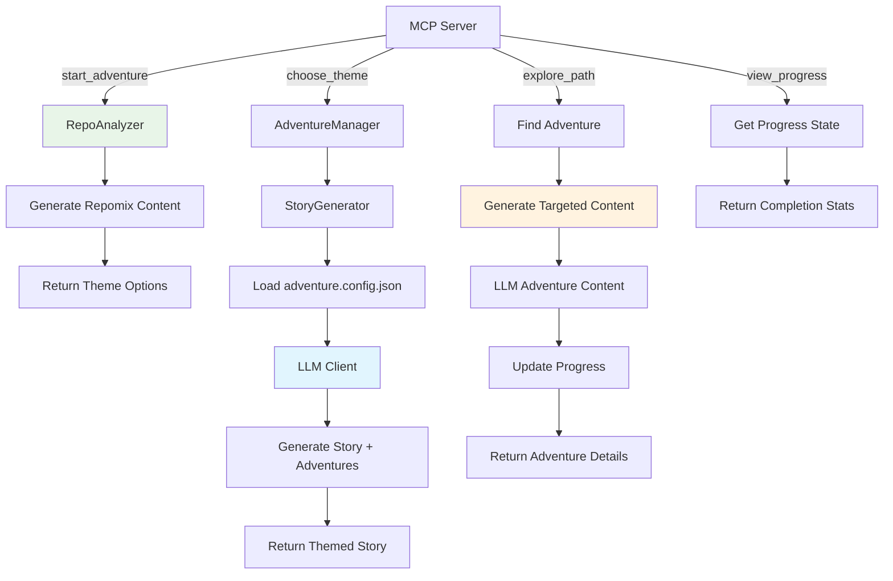
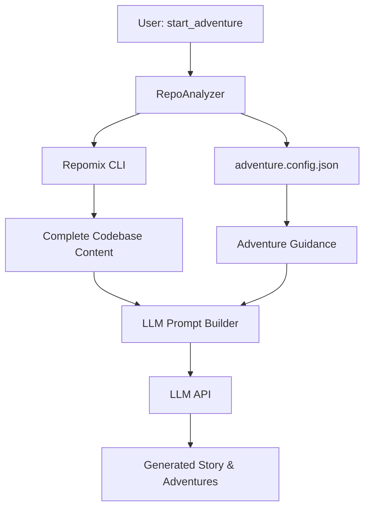

# Repo Adventure MCP Server

A fun, Model Context Protocol (MCP) server that transforms code repositories into interactive adventures! Explore codebases through engaging stories with characters that represent different technologies and architectural components.

## Features

🎮 **Story-based Code Exploration** - Turn learning about codebases into a "choose your own adventure" story
📚 **Educational Analogies** - Complex technical concepts explained through relatable story elements  
🌟 **Multiple Themes** - Choose from Space, Medieval, or Ancient Civilization themes
🤖 **Character-Based Learning** - Meet characters that represent different technologies (Database Dragons, API Messengers, etc.)
🔍 **Choose Your Own Adventure** - Interactive exploration paths through the codebase

## How It Works

1. **Start Adventure** - The server analyzes your project using repomix and presents theme options
2. **Choose Theme** - Select from Space Exploration, Mythical Kingdom, or Ancient Civilization
3. **Explore Adventures** - Follow dynamically generated adventure paths through your codebase
4. **View Progress** - Track your exploration progress and see completed areas
5. **Learn Through Story** - Understand complex systems through engaging LLM-generated narratives

## Architecture Flow



## 🔍 Project Context Gathering & LLM Integration

### Data Flow Architecture



### Phase 1: Project Analysis & Context Gathering

#### Step 1: Initial Project Scan
**Location:** `src/analyzer/repo-analyzer.ts`

When `start_adventure` is called, the system:
1. **Executes Repomix CLI** as a subprocess (`npx repomix`)
2. **Captures stdout** containing the entire codebase structure and content
3. **Caches result** with SHA256 hash for 5-minute reuse

**Repomix Output Structure:**
```markdown
# Project Summary
- Files: 50
- Languages: TypeScript (85%), JavaScript (15%)

## File: src/server.ts
```typescript
class RepoAdventureServer {
  constructor() { ... }
  setupHandlers() { ... }
}
```
// ... continues for ALL files in the project
```

#### Step 2: Adventure Config Loading
**Location:** `src/shared/adventure-config.ts`

Optionally loads `adventure.config.json` from the project root, which provides:
- Predefined adventure titles and descriptions
- Important files and functions to highlight
- Workshop-style exploration guidance

### Phase 2: LLM Prompt Construction

#### What Gets Sent to LLM for Initial Story Generation

The system sends a comprehensive prompt (~5,000-15,000 tokens) containing:

1. **Complete Repomix Output** - Every file in the project with full content
2. **Adventure Config Guidance** (if available) - Predefined adventures with highlighted functions
3. **Theme Guidelines** - Vocabulary, metaphors, and style rules for the selected theme
4. **Critical Instructions** - Rules for code authenticity and story structure

**Example prompt structure:**
```markdown
You are a technical education specialist creating story-based workshops...

## Complete Codebase
[Full repomix output with all files]

## Adventure Guidance (Optional)
Adventure: "Core MCP Server"
Files:
    File: src/server.ts
    Key Functions:
      - RepoAdventureServer.setupHandlers: Registers handlers
      [... more highlights]

## Theme Guidelines
[Space/Mythical/Ancient vocabulary and mappings]

## Response Format
Return JSON with story and adventures array
```

#### LLM Response
The LLM generates:
- A 2-3 paragraph themed story introducing the codebase
- 2-6 dynamic adventures based on project complexity
- Each adventure includes specific files to explore

### Phase 3: Individual Adventure Content Generation

#### What Gets Sent for Each Adventure

When exploring a specific adventure (~2,000-5,000 tokens):

1. **Targeted File Content** - Only files relevant to that adventure
2. **Workshop Highlights** - Specific functions to explore step-by-step
3. **Theme Continuity** - Same vocabulary for consistent narrative
4. **Code Authenticity Rules** - Must use actual code from files

**Example adventure prompt:**
```markdown
Continue the space-themed exploration for: "Command Protocols"

## Complete Codebase
[Only relevant files for this adventure]

## Workshop Highlights (Focus Areas)
Create a step-by-step workshop for:
- RepoAdventureServer.constructor: Creates MCP server
- RepoAdventureServer.setupHandlers: Registers handlers
[... more function highlights]

## Response Format
Return JSON with adventure narrative, code snippets, and hints
```

### Adventure Configuration System

#### adventure.config.json Structure

Projects can include an `adventure.config.json` file to guide story generation:

```json
{
  "adventures": [
    {
      "title": "Core MCP Server",
      "description": "Explore the MCP protocol implementation",
      "files": [
        {
          "path": "src/server.ts",
          "description": "Main MCP server",
          "highlights": [
            {
              "name": "RepoAdventureServer.setupHandlers",
              "description": "Registers ListTools and CallTool handlers"
            }
          ]
        }
      ]
    }
  ]
}
```

This configuration:
- **Guides adventure titles** toward important code areas
- **Highlights key functions** for workshop-style exploration
- **Provides context** for more accurate story generation
- **Remains optional** - system works without it using dynamic analysis

### Context Flow Summary

| Component | Purpose | What It Adds to LLM Context |
|-----------|---------|----------------------------|
| **Repomix** | Full codebase analysis | Actual code, file structure, all content |
| **Adventure Config** | Guidance structure | Important functions to highlight, suggested titles |
| **Theme System** | Narrative consistency | Vocabulary, metaphors, character types |
| **Workshop Highlights** | Educational focus | Step-by-step exploration of key functions |

### Optimization Features

- **Targeted Content**: Adventures only receive relevant file content
- **Smart Caching**: Repomix output cached for 5 minutes, LLM responses cached
- **Config Loading**: Loaded once per session if available
- **Fallback System**: Works without LLM using template-based stories

## Installation

```bash
npm install
npm run build
```

## Configuration

### LLM Setup (Optional - Enables Dynamic Story Generation)

The server supports multiple LLM providers through a generic OpenAI-compatible client:

1. **Choose Your Provider** and copy the configuration:
   ```bash
   cp .env.example .env
   ```

2. **Configure Your Preferred Provider**:

   **🆓 GitHub Models (Free tier available)**:
   ```bash
   GITHUB_TOKEN=your_github_token_here
   LLM_BASE_URL=https://models.inference.ai.azure.com
   LLM_MODEL=gpt-4o-mini
   ```

   **🔥 OpenAI (Direct)**:
   ```bash
   OPENAI_API_KEY=your_openai_key_here
   LLM_BASE_URL=https://api.openai.com/v1
   LLM_MODEL=gpt-4o-mini
   ```

   **🏢 Azure OpenAI**:
   ```bash
   AZURE_OPENAI_API_KEY=your_azure_key_here
   LLM_BASE_URL=https://your-resource.openai.azure.com/openai/deployments/your-deployment
   LLM_MODEL=gpt-4o
   ```

   **🏠 Local Ollama**:
   ```bash
   LLM_BASE_URL=http://localhost:11434/v1
   LLM_API_KEY=ollama
   LLM_MODEL=llama3.2
   ```

3. **Fine-tune Settings** (Optional):
   ```bash
   LLM_TEMPERATURE=0.7      # Creativity (0.0-1.0)
   LLM_MAX_TOKENS=1000      # Response length
   ```

**📝 Model Recommendations**:
- **Best Creative Writing**: `claude-3-5-sonnet`
- **Most Cost-Effective**: `gpt-4o-mini`  
- **Local/Private**: `llama3.2` (via Ollama)

**Note**: The server works without LLM configuration (using intelligent fallback templates), but dynamic LLM-generated stories provide much more engaging and personalized experiences.

## Testing

```bash
npm run test-mcp    # Run TypeScript test suite
npm run test-mcp-js # Run legacy JavaScript test suite (if needed)
```

## Usage with Claude Desktop

### Quick Install (Recommended)
```bash
npm run install-mcp
```

### Manual Installation
Add this server to your Claude Desktop configuration at `~/Library/Application Support/Claude/claude_desktop_config.json`:

```json
{
  "mcpServers": {
    "repo-adventure": {
      "command": "node",
      "args": ["/absolute/path/to/mcp-repo-adventure/dist/server.js"],
      "cwd": "/path/to/project/you/want/to/explore"
    }
  }
}
```

### Local Configuration
A local `claude_desktop_config.json` is included for project-specific setup.

## Usage with GitHub Copilot Chat

Configure as an MCP server in your development environment.

## Available Tools

### `start_adventure`
Analyzes your code repository using repomix and begins an interactive, gamified exploration experience. Presents theme options for your adventure.

**Parameters:**
- `projectPath` (optional): Path to project directory (defaults to current directory)

### `choose_theme`
Generates a personalized, LLM-powered narrative adventure based on your selected theme. Creates dynamic adventures based on your actual project structure.

**Parameters:**
- `theme`: "space", "mythical", or "ancient" (also accepts numbers: 1, 2, 3)

### `explore_path`
Executes a chosen adventure to explore specific parts of your codebase through LLM-generated narrative content. Reveals code insights wrapped in themed storytelling.

**Parameters:**
- `choice`: Adventure number (1, 2, 3) or adventure title/partial title

### `view_progress`
Displays comprehensive progress tracking for your code exploration adventure. Shows completion percentage, completed adventures, and remaining areas to explore.

**Parameters:**
- None required - automatically tracks state from previous tool calls

## Example Adventure Flow

```
1. start_adventure() 
   → Generates repomix content for your TypeScript/Node.js project
   → "🌟 Welcome to Repo Adventures! You've discovered 45 files of digital wisdom!"
   → "Choose Your Story Theme: 1. 🚀 Space 2. 🏰 Mythical 3. 🏛️ Ancient"

2. choose_theme("space")
   → LLM analyzes your repomix content and generates personalized story
   → "In the cosmic realm of API Service, the advanced Starship 'TypeScript' 
      navigates through 45 star systems..."
   → "Available Adventures: 1. 🧭 Navigation Protocols 2. 📡 Communication Hub"

3. explore_path("1")
   → LLM generates detailed adventure content using actual code files
   → "As you enter the Navigation Control Center, you discover the sacred 
      algorithm that guides all requests..."
   → Shows real code snippets with explanations in space theme
   → "Progress: 33% complete (1/3 adventures finished)"

4. view_progress()
   → "📊 Adventure Progress: 33% complete"
   → "✅ Completed: Navigation Protocols"
   → "🗺️ Remaining: Communication Hub, System Diagnostics"
```

## Project Structure

```
src/
├── server.ts                          # Main MCP server with tool orchestration
├── tools.ts                           # MCP tool definitions and handlers
├── analyzer/            
│   └── repo-analyzer.ts               # Simple repomix wrapper (no LLM analysis)
├── adventure/
│   ├── adventure-manager.ts           # Manages adventure state and progression
│   ├── story-generator.ts             # LLM-powered story generation with fallbacks
│   ├── story-template-engine.ts       # Template-based fallback stories
│   ├── theme-manager.ts               # Theme definitions and vocabulary
│   ├── adventure-path-generator.ts    # Generates exploration paths
│   └── file-content-manager.ts        # Reads and prepares code files
├── llm/
│   └── llm-client.ts                  # Multi-provider LLM client with caching
├── shared/
│   ├── config.ts                      # Centralized configuration
│   ├── types.ts                       # Shared interfaces (ProjectInfo, etc.)
│   ├── instances.ts                   # Singleton instances with caching
│   ├── theme.ts                       # Theme utilities and validation
│   ├── input-validator.ts             # Security-focused input validation
│   ├── cache.ts                       # LRU cache implementation
│   └── errors.ts                      # Error handling utilities
└── utils/
    └── zod-to-json-schema.ts          # Zod schema conversion for MCP
```

## Key Architecture Principles

- **🎯 LLM-First**: Raw repomix content passed directly to LLM for analysis during story generation
- **💾 Smart Caching**: Both repomix generation and LLM responses are cached (5min TTL)
- **🔄 Graceful Fallbacks**: Template-based stories when LLM unavailable
- **🛡️ Security-First**: Comprehensive input validation and path traversal protection
- **⚡ Performance**: Optimized with singletons, caching, and minimal processing
- **🧪 Testable**: Modular design with 100% unit test coverage

## Supported Technologies

The server automatically detects and creates characters for:
- **Databases** (MongoDB, PostgreSQL, MySQL, etc.)
- **APIs** (REST, GraphQL, Node.js)
- **Frontend** (React, Vue, Angular, TypeScript, JavaScript)
- **Backend** (Node.js, Python, Java, C#, Go, Rust)
- **Testing** (Jest, Cypress, etc.)
- **DevOps** (Docker, Kubernetes)

## Contributing

Contributions welcome! Feel free to add new themes, characters, or adventure paths.

## License

MIT