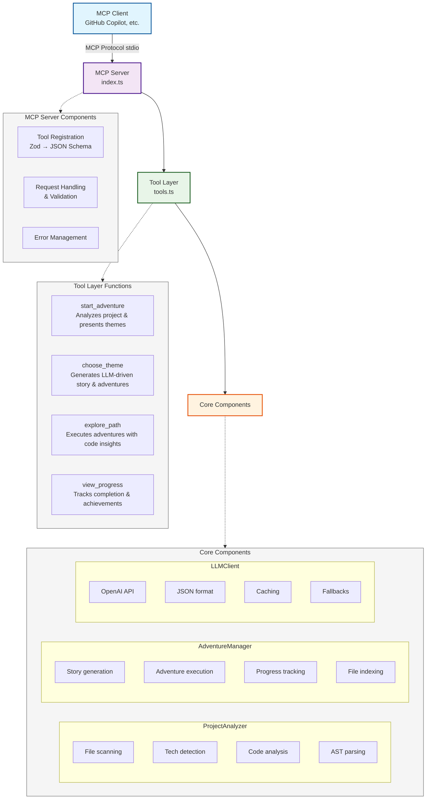

# MCP Repo Adventure Architecture

## Overview

MCP Repo Adventure is a Model Context Protocol (MCP) server that creates a fun environment for code repository exploration through AI-driven, interactive storytelling. The system is designed to leverage Large Language Models (LLMs) for dynamic content generation, moving away from static, character-based interactions to fully adaptive adventures.

## Architecture Diagram



## Core Components

### 1. **MCP Server (`src/index.ts`)**
The main entry point that:
- Implements the MCP protocol over stdio transport
- Dynamically registers tools from the `/tools` directory
- Converts Zod schemas to JSON Schema for MCP compatibility
- Handles request routing and error management

### 2. **Tool System (`src/tools.ts`)**
Modular tool architecture with four main tools:

#### `start_adventure`
- Analyzes the target repository using ProjectAnalyzer
- Presents theme options to the user
- Shows initial project metrics (functions, classes, dependencies)

#### `choose_theme`
- Accepts theme selection (space/medieval/ancient)
- Calls AdventureManager to generate LLM-driven story
- Returns themed narrative with available adventures

#### `explore_path`
- Handles adventure selection (by number, ID, or title)
- Generates detailed adventure content with code insights
- Updates progress tracking

#### `view_progress`
- Shows completion percentage and finished adventures
- Lists remaining adventures
- Provides achievement summary

### 3. **AdventureManager (`src/adventure/AdventureManager.ts`)**
The core storytelling engine featuring:

#### LLM Integration
- Uses OpenAI's `response_format: 'json_object'` for reliable JSON responses
- Structured prompts with theme vocabulary and guidelines
- Fallback story generation when LLM unavailable

#### State Management
```typescript
class AdventureState {
  story: string | undefined
  adventures: Adventure[]
  completedAdventures: Set<string>
  currentTheme: string
  projectInfo: ProjectInfo | undefined
  
  get progressPercentage(): number  // Computed property
}
```

#### Key Methods
- `initializeAdventure()`: Generates story and adventures based on project analysis
- `exploreAdventure()`: Creates detailed content for specific adventures
- `getProgress()`: Returns current completion status

#### Performance Optimizations
- File indexing with O(1) lookups using Map
- Efficient adventure matching by number, ID, or title
- Cached project analysis

### 4. **LLMClient (`src/llm/LLMClient.ts`)**
Manages all LLM interactions:

#### Features
- Configurable providers (OpenAI, GitHub Models, custom)
- Request caching with TTL
- Timeout handling for MCP compatibility
- JSON response format support
- Comprehensive fallback system

#### Configuration
```typescript
interface LLMRequestOptions {
  systemPrompt?: string
  responseFormat?: 'text' | 'json_object'
}
```

### 5. **ProjectAnalyzer (`src/analyzer/ProjectAnalyzer.ts`)**
Analyzes codebases to provide context:

#### Analysis Capabilities
- Technology detection via file patterns
- Function and class extraction using AST parsing
- Dependency categorization
- Entry point identification
- Code flow analysis

#### Optimization Features
- Concurrent file processing
- Parser pooling for memory efficiency
- Configurable timeouts and limits
- Smart file filtering

### 6. **Response Handling**
Handles LLM responses with basic validation:

#### Features
- JSON parsing with error handling
- Basic structure validation (story/adventures present)
- Fallback content generation when LLM fails
- Simple error reporting and logging

## Data Flow

### 1. **Adventure Initialization**
```
User → start_adventure → ProjectAnalyzer → Project metrics
User → choose_theme → AdventureManager → LLMClient → Generated story
```

### 2. **Adventure Exploration**
```
User → explore_path → AdventureManager → LLMClient → Adventure content
                    ↓
              Progress tracking → State update
```

### 3. **Error Handling**
```
LLM timeout/error → Fallback generation → Static content
Invalid JSON → Basic validation → Simple error → Retry/Fallback
```

## Key Design Decisions

### 1. **LLM-Driven Content**
- **Why**: Dynamic, contextual stories vs static templates
- **How**: Structured prompts with project analysis
- **Benefit**: Unique experience for every codebase

### 2. **JSON Response Format**
- **Why**: Eliminate parsing errors from LLM responses
- **How**: OpenAI's `response_format` parameter
- **Benefit**: 100% valid JSON, no complex cleaning needed

### 3. **File Indexing**
- **Why**: O(n) file searches were slow for large projects
- **How**: Map-based index with multiple lookup strategies
- **Benefit**: O(1) lookups for better performance

### 4. **Modular Architecture**
- **Why**: Separation of concerns, easier testing
- **How**: Clear boundaries between analysis, generation, and state
- **Benefit**: Maintainable, extensible codebase

### 5. **Comprehensive Fallbacks**
- **Why**: LLM services can be unreliable
- **How**: Static content generation at every level
- **Benefit**: System never completely fails

## Configuration

### Environment Variables
```bash
# LLM Provider Configuration
LLM_PROVIDER=openai|github|custom
OPENAI_API_KEY=your-key
GITHUB_TOKEN=your-token
LLM_BASE_URL=https://custom-endpoint
LLM_MODEL=gpt-4o

# Analysis Limits
MAX_FILE_SIZE_MB=10
MAX_FUNCTIONS=20
MAX_CLASSES=5
```

### MCP Client Configuration
```json
{
  "mcpServers": {
    "repo-adventure": {
      "command": "node",
      "args": ["/path/to/mcp-repo-adventure/dist/index.js"],
      "cwd": "/path/to/target/project"
    }
  }
}
```

## Testing Strategy

### Unit Tests
- **Basic functionality**: JSON parsing and fallback testing
- **File indexing**: Performance and accuracy tests
- **Prompt building**: Structure verification
- **Error handling**: Fallback scenarios

### Integration Tests
- **End-to-end flows**: Complete adventure cycles
- **LLM timeouts**: Fallback behavior
- **Large projects**: Performance under load

## Future Enhancements

### Planned Features
1. **Multi-file code analysis**: Read actual file contents for deeper insights
2. **Adventure branching**: Non-linear story paths
3. **Collaborative mode**: Multi-user exploration
4. **Custom themes**: User-defined story worlds
5. **Export functionality**: Save adventures as documentation

### Performance Improvements
1. **Streaming responses**: Progressive story revelation
2. **Parallel adventure generation**: Faster initialization
3. **Smart caching**: Project-specific story caching
4. **Incremental analysis**: Update only changed files

## Troubleshooting

### Common Issues

#### LLM Timeouts
- **Symptom**: "LLM request timed out after 15000ms"
- **Cause**: Slow API response or network issues
- **Solution**: System automatically uses fallback content

#### Invalid Theme
- **Symptom**: "Invalid theme" error
- **Cause**: Theme not in allowed list
- **Solution**: Use 'space', 'medieval', or 'ancient'

#### Large Projects
- **Symptom**: Slow analysis or timeouts
- **Cause**: Too many files to process
- **Solution**: Adjust timeout configurations

## Conclusion

The MCP Repo Adventure architecture demonstrates how to build robust LLM-powered applications with proper error handling, performance optimization, and user experience considerations. The modular design allows for easy extension while maintaining system reliability through comprehensive fallback mechanisms.