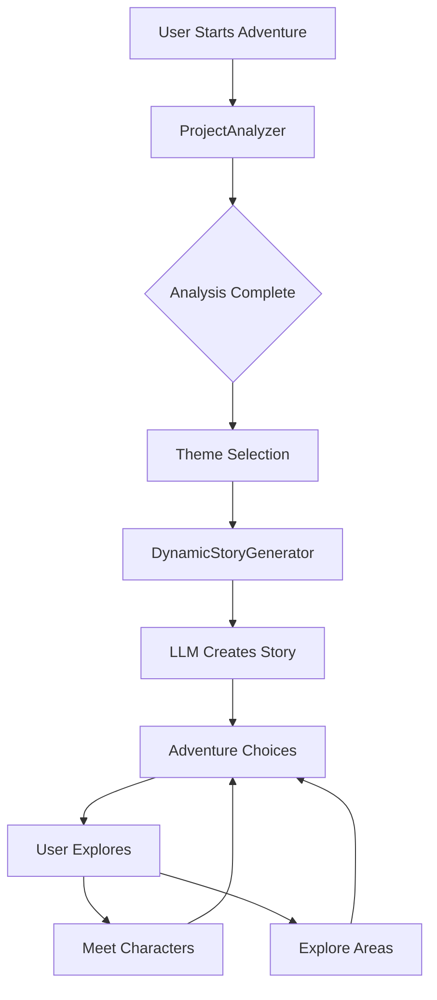

# MCP Repo Adventure - User Flow & Architecture

## 🎮 End User Experience Flow

### 1. **Starting the Adventure**
```
User: "Start a repo adventure for /path/to/project"
```
- **Tool**: `start_adventure`
- **What happens**:
  - ProjectAnalyzer scans the codebase (currently ~44ms)
  - Detects technologies, functions, classes, dependencies
  - Analyzes code flow and execution order
  - Returns welcome message with theme choices

### 2. **Theme Selection**
```
User: "Choose space theme"
```
- **Tool**: `choose_theme`
- **What happens**:
  - DynamicStoryGenerator receives full project analysis
  - LLM generates personalized story based on:
    - Actual functions/classes found
    - Real dependencies and their purposes
    - Code execution flow
    - File structure and architecture
  - Returns themed introduction with initial adventure choices

### 3. **Exploring the Codebase**
```
User: "Meet Data Navigator Zara"
```
- **Tool**: `meet_character`
- **What happens**:
  - Character represents real code component
  - Provides insights about their "domain" (actual functionality)
  - Offers next steps based on code relationships

### 4. **Choose Your Own Adventure Paths**
```
User: "Explore the configuration systems"
```
- **Tool**: `explore_path`
- **Available Adventures**:
  - **Configuration Quest**: Explore config files, environment setup
  - **Test Chamber**: Understand testing architecture
  - **Main Flow Journey**: Follow primary execution path
  - **API Gateway**: Explore endpoints and interfaces
  - **Database Depths**: Understand data layer
  - **Build Pipeline**: Learn about compilation/deployment

## 🏗️ Architecture Flow



## 🚀 Current Implementation Status

### ✅ **Working Features**
1. **Multi-language code analysis** (TypeScript, JavaScript, Python, etc.)
2. **Function/class detection** with summaries
3. **Dependency categorization** (framework, testing, utility)
4. **Code flow analysis** (imports, calls, execution order)
5. **Dynamic story generation** via LLM (GitHub Models)
6. **Theme-based narratives** (space, medieval, ancient)
7. **Character mapping** to real code components

### 🔄 **Optimization Opportunities**

#### 1. **Background Analysis During Theme Selection**
Currently sequential - could be parallelized:
```typescript
// Current flow:
1. start_adventure (runs analysis) → 2. choose_theme → 3. generate story

// Optimized flow:
1. start_adventure (triggers analysis) → 2. show themes immediately
   ↓ (analysis runs in background)
3. choose_theme → 4. story ready instantly
```

#### 2. **Adventure Complexity Scaling**
- **Simple projects**: 3-4 main adventures
- **Medium projects**: 5-7 adventures with sub-quests
- **Complex projects**: Multiple adventure "chapters" for different subsystems

#### 3. **Intelligent Path Generation**
Based on code analysis:
- If many tests → "Test Chamber" adventure
- If API routes → "Gateway Exploration" 
- If database models → "Data Vault Quest"
- If complex flow → Multiple "Flow Chapters"

## 📊 Performance Metrics

- **Analysis time**: ~44ms for 16-file project
- **Story generation**: 1-3 seconds (LLM dependent)
- **Total time to adventure**: ~3-4 seconds

## 🎯 User Benefits

1. **Learn by Exploring**: Understand codebases through narrative
2. **Real Analogies**: Complex concepts explained via theme
3. **Guided Discovery**: Follow actual code execution paths
4. **Memorable Characters**: Functions/classes as personalities
5. **Choose Your Path**: Focus on areas of interest

## 🔧 MCP Integration

### Claude Desktop Configuration
```json
{
  "mcpServers": {
    "repo-adventure": {
      "command": "node",
      "args": ["/path/to/mcp-repo-adventure/dist/index.js"]
    }
  }
}
```

### Usage in Claude
1. "Start a repo adventure for my project"
2. "I choose the space theme"
3. "Let's explore the API endpoints"
4. "Meet the Database Guardian"

## 🚦 Next Steps for Enhancement

1. **Parallel Analysis**: Start analysis immediately, show results when ready
2. **Adventure Templates**: Pre-built paths for common architectures
3. **Progress Tracking**: Remember visited areas across sessions
4. **Difficulty Levels**: Beginner/Advanced exploration modes
5. **Export Stories**: Save adventure transcript for documentation